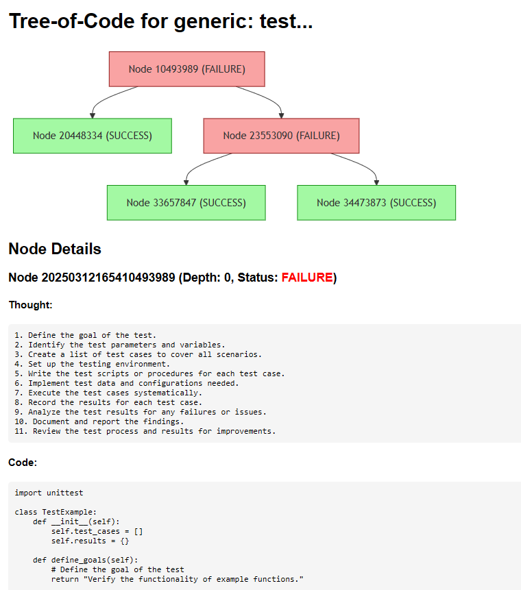
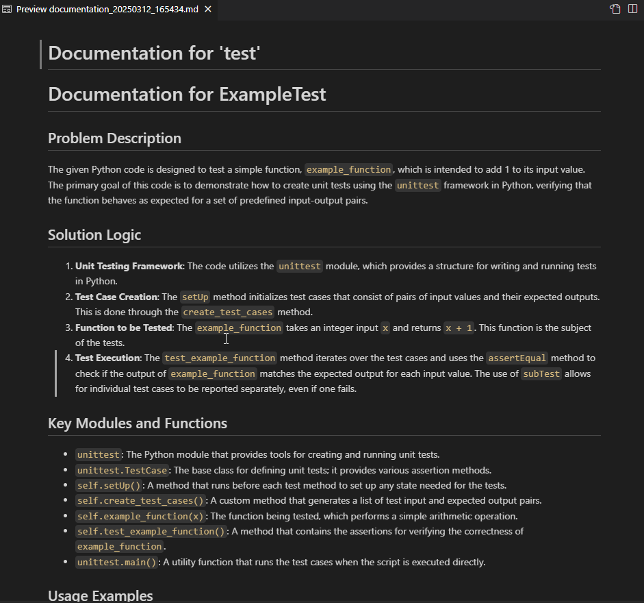
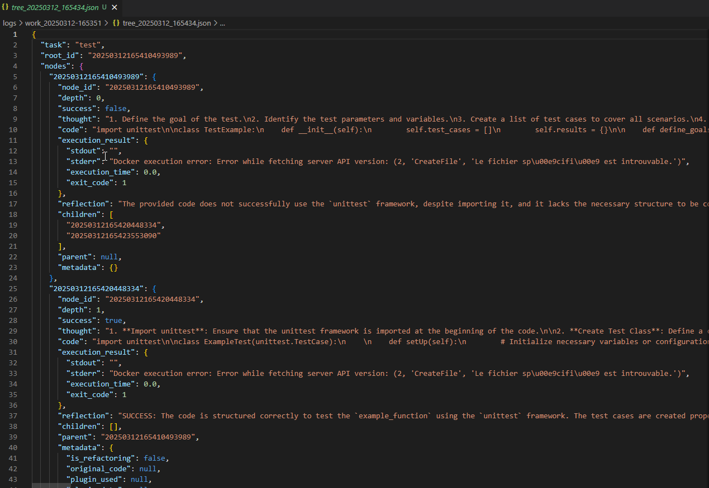

# Tree of Code Agent


Tree of Code (TOC) Agent est une plateforme avancée d'IA générative qui utilise une approche arborescente d'exploration pour créer, refactoriser, documenter et corriger du code de manière intelligente.

**Tree-of-Code** est un cadre d'exploration arborescente conçu pour la génération et l'exécution de code de bout en bout dans la gestion de tâches complexes. citeturn0search0 Cette approche vise à améliorer la cohérence et la robustesse des agents basés sur des modèles de langage en explorant systématiquement différentes solutions sous forme d'arbre, chaque nœud représentant un programme de code exécutable.

**Fonctionnement du cadre Tree-of-Code :**

1. **Génération de la pensée et du code** : L'agent génère une stratégie de résolution sous forme de code exécutable.
2. **Exécution** : Le code est exécuté dans un environnement sécurisé, et les résultats sont analysés.
3. **Réflexion et expansion de l'arbre** : En fonction des résultats, l'agent réfléchit aux améliorations possibles et explore d'autres branches de l'arbre pour optimiser la solution.
4. **Sélection du résultat final** : Les solutions exécutées avec succès sont évaluées, et l'agent détermine la réponse la plus appropriée en fonction des résultats obtenus.

Cette approche permet aux agents de langage de réaliser des processus de décision délibérés en considérant plusieurs chemins de raisonnement, en évaluant les choix et en revenant en arrière si nécessaire pour résoudre efficacement des problèmes complexes. [arxiv](https://arxiv.org/html/2412.15305v1)

**Avantages de l'approche Tree-of-Code :**

- **Cohérence améliorée** : En générant des solutions de bout en bout, l'agent réduit les interruptions et les incohérences dans le processus de génération de code.
- **Robustesse accrue** : L'exploration systématique de différentes solutions permet de minimiser les erreurs et d'améliorer la fiabilité des résultats.
- **Efficacité** : En explorant plusieurs solutions en parallèle et en sélectionnant la meilleure, l'agent optimise le temps et les ressources nécessaires à la résolution de tâches complexes.

En somme, le cadre Tree-of-Code représente une avancée significative dans l'utilisation des modèles de langage pour la génération et l'exécution de code, offrant une approche structurée et efficace pour la gestion de tâches complexes. 

## Fonctionnalités

- **Génération de code** : Création de code à partir de descriptions en langage naturel
- **Refactorisation de code** : Amélioration automatique de la qualité et des performances du code existant
- **Documentation de code** : Génération de documentation complète et pertinente pour votre code
- **Correction de bugs** : Identification et résolution automatique d'erreurs dans le code
- **Visualisation de l'arborescence** : Représentation visuelle du processus d'exploration des solutions
- **Plugins extensibles** : Système de plugins pour étendre les fonctionnalités (recherche web, etc.)
- **Exécution sécurisée** : Exécution du code dans un environnement Docker isolé
- **Interface web réactive** : Interface utilisateur moderne et intuitive avec React
- **API REST FastAPI** : API complète pour l'intégration avec d'autres systèmes
- **Communication en temps réel** : WebSockets pour suivre l'avancement des tâches en direct

## Architecture du système

Le système est composé de deux composants principaux :
- **Backend Python** : 
  - Moteur d'IA avec TreeOfCodeEngine pour l'exploration arborescente des solutions
  - Exécution sécurisée du code via Docker
  - API REST FastAPI avec endpoints `/solve`, `/upload-and-process`, etc.
  - Communication WebSockets pour les mises à jour en temps réel
  - Système de plugins extensible (exemple: plugin DuckDuckGo pour la recherche)

### Example
("max_tree_depth": 2,
  "max_iterations_per_node": 2)





 ("max_tree_depth": 10,
  "max_iterations_per_node": 2)

- **Frontend React** : 
  - Interface utilisateur réactive basée sur React et Framer Motion
  - Design moderne avec thème clair/sombre
  - Visualisation des logs en temps réel via WebSockets
  - Support pour l'upload de fichiers
  - Composants stylisés avec CSS avancé

## Prérequis

- Python 3.9+
- Node.js 14+
- Docker
  - Sur Windows: Docker Desktop doit être installé et en cours d'exécution
  - Sur macOS: Docker Desktop
  - Sur Linux: Service Docker
- Clé API OpenAI

## Installation

### 1. Configuration de l'environnement Python

```bash
# Cloner le dépôt
git clone https://github.com/votre-utilisateur/toc_agents.git
cd toc_agents

# Créer un environnement virtuel
python -m venv env

# Activer l'environnement virtuel
## Pour Linux/MacOS
source env/bin/activate
## Pour Windows
env\Scripts\activate

# Installer les dépendances Python
pip install -r requirements.txt
```

### 2. Installation des dépendances Node.js

```bash
# Installer les dépendances Node.js (React, Framer Motion, etc.)
npm install
```

### 3. Configuration de Docker

Assurez-vous que Docker est installé et en cours d'exécution :
- Sur Windows : Lancez Docker Desktop depuis le menu démarrer
- Sur macOS : Lancez Docker Desktop depuis les Applications
- Sur Linux : Vérifiez que le service Docker est actif avec `sudo systemctl status docker`

### 4. Configuration des variables d'environnement

Créez un fichier `.env` à la racine du projet avec le contenu suivant :

```
OPENAI_API_KEY=votre_clé_api_openai
USE_DOCKER=true  # Mettre à false si Docker n'est pas disponible
```

## Démarrage

Pour lancer l'application, vous devez démarrer à la fois le backend et le frontend :

### 1. Démarrer le backend

```bash
# Dans un terminal, depuis le répertoire principal
cd src
uvicorn api:app --reload
```

Le serveur FastAPI démarrera sur http://localhost:8000 avec les endpoints suivants:
- `POST /solve` - Pour soumettre une tâche de génération de code
- `POST /upload-and-process` - Pour uploader et traiter un fichier
- `GET /task/{task_id}` - Pour vérifier le statut d'une tâche
- `WS /ws` - WebSocket pour les mises à jour en temps réel

La documentation interactive de l'API est disponible sur http://localhost:8000/docs

### 2. Démarrer le frontend

```bash
# Dans un autre terminal, depuis le répertoire principal
npm run dev
```

L'application frontend React sera accessible à l'adresse [http://localhost:5173](http://localhost:5173)

## Utilisation

1. Accédez à l'interface web React
2. Sélectionnez le type de tâche :
   - **Créer un nouveau code** : Générer du code à partir d'une description
   - **Refactoriser un code existant** : Améliorer un code existant
   - **Documenter un code existant** : Générer la documentation d'un code
   - **Corriger des erreurs dans un code** : Identifier et corriger les bugs

3. Entrez votre description de tâche dans l'interface React
4. Pour les tâches nécessitant un fichier d'entrée, vous pouvez :
   - Uploader directement un fichier via l'interface
   - Ou fournir le chemin d'un fichier existant
5. Soumettez votre demande et suivez le processus en temps réel via les logs WebSocket

## Exemples d'utilisation

### Génération de code

```
Développer une fonction Python qui calcule la factorielle d'un nombre de façon récursive et itérative
```

### Refactorisation de code

```
Refactoriser ce code pour améliorer sa lisibilité et sa performance : [chemin vers le fichier]
```

### Documentation de code

```
Documenter ce code de manière exhaustive : [chemin vers le fichier]
```

### Correction de bugs

```
Identifier et corriger les bugs dans ce code : [chemin vers le fichier]
```

## Utilisation via la ligne de commande

L'application peut également être utilisée via la ligne de commande :

```bash
python src/agent.py --task "Créer une fonction qui calcule la factorielle"
python src/agent.py --task "Refactoriser ce code" --file chemin/vers/fichier.py --refactor
python src/agent.py --task "Documenter ce code" --file chemin/vers/fichier.py --document
python src/agent.py --task "Corriger les bugs" --file chemin/vers/fichier.py --fix
```

## Utilisation via l'API REST

Vous pouvez également intégrer Tree of Code Agents dans vos propres applications via l'API REST:

```python
import requests
import json

# Générer du code
response = requests.post(
    "http://localhost:8000/solve",
    json={"task": "Créer une fonction qui calcule la factorielle"}
)
print(response.json())

# Refactoriser un fichier distant
response = requests.post(
    "http://localhost:8000/solve",
    json={"task": "Refactor: Améliorer ce code", "file_path": "/chemin/vers/fichier.py"}
)
print(response.json())
```

## Structure du projet

```
toc_agents/
├── src/                 # Code source du backend et frontend
│   ├── agent.py         # Moteur principal Tree of Code
│   ├── api.py           # API FastAPI avec endpoints REST et WebSocket
│   ├── index.html       # Page HTML principale pour l'app React
│   ├── index.css        # Styles CSS avec thème clair/sombre
│   ├── main.jsx         # Point d'entrée React
│   ├── TaskManager.jsx  # Composant React principal avec WebSockets
│   └── plugin/          # Plugins extensibles (duckduckgo.py, etc.)
├── db/                  # Base de données SQLite pour la mémoire
├── logs/                # Logs et résultats des exécutions
│   └── work_**/         # Dossiers de travail par session
│       ├── solution_*.py      # Solutions générées
│       ├── documentation_*.md # Documentation générée
│       ├── tree_*.json        # Structure arborescente d'exploration
│       └── visualization_*.html # Visualisation HTML de l'arbre
├── requirements.txt     # Dépendances Python (FastAPI, Docker, OpenAI, etc.)
├── package.json         # Dépendances Node.js (React, Framer Motion, etc.)
└── vite.config.js       # Configuration Vite pour le frontend
```

## Interface utilisateur React

L'interface utilisateur React inclut les fonctionnalités suivantes:

- Sélection du type de tâche (création, refactorisation, documentation, correction)
- Champ de description de la tâche
- Option d'upload de fichier avec drag & drop
- Visualisation des logs en temps réel via WebSockets
- Animations fluides avec Framer Motion
- Design responsive adapté aux écrans mobiles et desktop
- Support des thèmes clair/sombre

## API FastAPI

L'API FastAPI expose les endpoints suivants:

| Endpoint | Méthode | Description |
|----------|---------|-------------|
| `/solve` | POST | Soumet une tâche de génération de code |
| `/upload-and-process` | POST | Upload et traitement d'un fichier |
| `/task/{task_id}` | GET | Récupération des informations sur une tâche |
| `/ws` | WebSocket | Communication en temps réel pour les logs |

## Fonctionnement interne

Tree of Code utilise une approche d'exploration arborescente pour générer et améliorer du code :

1. **Génération de pensée** : L'IA génère une stratégie de résolution du problème
2. **Génération de code** : Le code est généré en fonction de la pensée
3. **Exécution** : Le code est exécuté dans un environnement sécurisé (Docker)
4. **Réflexion** : Les résultats sont analysés pour déterminer si la solution est correcte
5. **Exploration** : Si nécessaire, plusieurs branches de solution sont explorées
6. **Sélection** : La meilleure solution est sélectionnée
7. **Documentation** : Une documentation complète est générée
8. **Visualisation** : Une visualisation HTML de l'arbre d'exploration est créée

## Exécution sécurisée avec Docker

Un aspect essentiel de Tree of Code est l'exécution sécurisée du code généré par l'IA pour chaque nœud de l'arbre d'exploration.

### Pourquoi Docker?

L'exécution de code généré par une IA présente des risques potentiels :
- Exécution accidentelle de code malveillant
- Accès non autorisé au système de fichiers
- Opérations consommant trop de ressources
- Problèmes de sécurité liés à l'exécution de code non vérifié

### Processus d'exécution en sandbox

Pour chaque nœud de l'arbre, le système suit ce processus :

1. **Isolement** : Le code généré est placé dans un conteneur Docker isolé basé sur l'image `python:3.9`
2. **Limitation des ressources** : Restrictions strictes sur la mémoire, le CPU et le temps d'exécution
3. **Pas d'accès réseau** : Le conteneur n'a pas accès au réseau externe
4. **Système de fichiers en lecture seule** : Prévient les modifications non autorisées
5. **Timeout** : L'exécution est limitée par défaut à 10 secondes (configurable)
6. **Capture des résultats** : Les sorties stdout/stderr et le code de retour sont capturés
7. **Nettoyage** : Le conteneur est détruit après l'exécution

### Implémentation technique

```python
def execute_code(self, code: str, timeout: int = 10) -> ExecutionResult:
    use_docker = os.environ.get("USE_DOCKER", "true").lower() == "true"
    if use_docker:
        try:
            docker_executor = DockerExecutor()
            output = docker_executor.execute_code(code, image="python:3.9")
            return ExecutionResult(stdout=output, stderr="", execution_time=0.0, exit_code=0)
        except Exception as e:
            logger.error(f"Error during Docker code execution: {str(e)}")
            return ExecutionResult(stdout="", stderr=f"Docker execution error: {str(e)}", execution_time=0.0, exit_code=1)
```

### Mode de secours (fallback)

Si Docker n'est pas disponible ou désactivé via la variable d'environnement `USE_DOCKER=false`, le système revient à une exécution locale plus limitée :

```python
else:
    temp_dir = tempfile.mkdtemp(prefix="toc_node_")
    code_file = os.path.join(temp_dir, "solution.py")
    try:
        with open(code_file, "w", encoding="utf-8") as f:
            f.write(code)
        # Exécution avec timeout et autres restrictions
        # ...
```

### Évaluation des résultats

Les résultats de l'exécution sont utilisés pour :
1. **Évaluer le succès** : Déterminer si le code a réussi à résoudre le problème
2. **Générer une réflexion** : Analyser les sorties pour comprendre les échecs
3. **Guider l'exploration** : Orienter l'IA vers de meilleures solutions dans les nœuds enfants
4. **Visualiser les résultats** : Afficher les résultats d'exécution dans la visualisation HTML

## Configuration avancée

Vous pouvez personnaliser le comportement du système en modifiant les paramètres dans votre fichier `.env` :

```
MAX_TREE_DEPTH=3          # Profondeur maximale de l'arbre d'exploration
MAX_ITERATIONS_PER_NODE=2 # Nombre d'itérations par nœud
THREAD_POOL_SIZE=4        # Taille du pool de threads pour le traitement parallèle
CODE_EXECUTION_TIMEOUT=10 # Timeout pour l'exécution du code (en secondes)
DOCKER_MEMORY_LIMIT=512m  # Limite de mémoire pour le conteneur Docker
DOCKER_CPU_LIMIT=1.0      # Limite de CPU pour le conteneur Docker
```

## Dépannage

### Erreurs Docker

Si vous voyez une erreur comme `Docker execution error: Error while fetching server API version`, vérifiez que :
- Docker est installé et en cours d'exécution
- Votre utilisateur a les permissions nécessaires pour utiliser Docker
- Définissez `USE_DOCKER=false` dans votre fichier `.env` pour exécuter le code localement (moins sécurisé)

### Problèmes d'API OpenAI

Si vous rencontrez des erreurs liées à l'API OpenAI, vérifiez que :
- Votre clé API est correcte et a des crédits disponibles
- Vous avez une connexion Internet stable
- Vous respectez les limites de taux de l'API OpenAI

### Erreurs Frontend React

Si vous rencontrez des problèmes avec le frontend React :
- Assurez-vous que le backend FastAPI est bien en cours d'exécution
- Vérifiez que les ports 8000 (API) et 5173 (React) sont disponibles
- Consultez la console de votre navigateur pour les erreurs JavaScript

## Contribution

Les contributions sont les bienvenues ! Voici comment vous pouvez contribuer :

1. Fork le projet
2. Créez une branche pour votre fonctionnalité (`git checkout -b feature/amazing-feature`)
3. Commitez vos changements (`git commit -m 'Add amazing feature'`)
4. Push sur la branche (`git push origin feature/amazing-feature`)
5. Ouvrez une Pull Request

## Licence

Ce projet est sous licence MIT. Voir le fichier `LICENSE` pour plus de détails.

